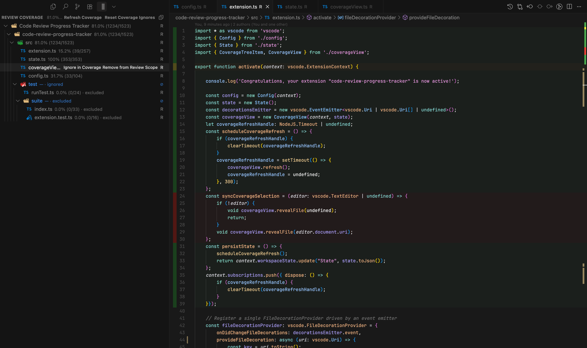

# Code Review Progress Tracker

## Description

Code Review Progress Tracker is a Visual Studio Code extension designed to help developers track their progress while reviewing code. It allows users to mark specific lines or sections of code in different review states like 'OK', 'Warning', and 'Danger'.

## Features

- **Mark Sections**: Easily mark sections of code as reviewed with different statuses (OK, Warning, Danger).
- **Clear Marks**: Remove review marks from a section or clear all marks in a file.
- **Persistent State**: Review marks are saved and restored across VS Code sessions.

## Installation

To install the Code Review Progress Tracker, download a [realease](https://github.com/narbonnais/Code-Review-Progress-Tracker/releases) and follow these steps:

1. Open Visual Studio Code.
2. Open the command palette (`Ctrl+Shift+P` or `Cmd+Shift+P`).
3. Type `Extensions: Install from VSIX...` and press Enter.
4. Select the downloaded VSIX file and press Enter.

## Usage

After installation, you can use the following commands:

- `code-review-progress-tracker.reviewedOk`: Mark a section as OK.
- `code-review-progress-tracker.reviewedWarning`: Mark a section with a warning.
- `code-review-progress-tracker.reviewedDanger`: Mark a section as dangerous.
- `code-review-progress-tracker.reviewedClear`: Clear review mark from a section.
- `code-review-progress-tracker.reviewedClearAll`: Clear all review marks from the current file.
- `code-review-progress-tracker.reviewedFileOk`: Add a ✓ marker to the file in the explorer.
- `code-review-progress-tracker.reviewedFileWarning`: Add a ? marker to the file in the explorer.
- `code-review-progress-tracker.reviewedFileDanger`: Add a ✗ marker to the file in the explorer.
- `code-review-progress-tracker.reviewedFileOutOfScope`: Add a ⊘ marker to the file in the explorer.
- `code-review-progress-tracker.reviewedFileClear`: Remove the marker from the file in the explorer.

To use these commands, select the code you want to mark, open the Command Palette (`Ctrl+Shift+P` or `Cmd+Shift+P`), and type the command. It is also recommended to bind essential commands to keyboard shortcuts.

## Requirements

- Visual Studio Code 1.50.0 or higher.

## Extension Settings

There are no extension settings at this time.

## Known Issues

No known issues so far. If you find any bugs or have a feature request, please open an issue.

## Release Notes

### 1.0.2

- Added file markers to the explorer.

### 1.0.1

- Fixed a bug where the extension would not work.

### 1.0.0

- Initial release of Code Review Progress Tracker.

## Contributing

Contributions are always welcome! If you have any ideas, suggestions, or bug reports, please open an issue or submit a pull request.
